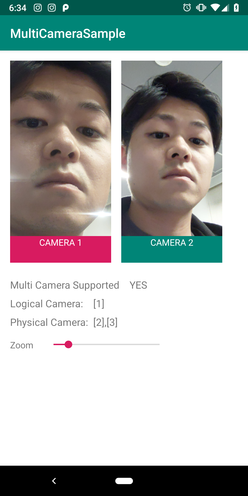
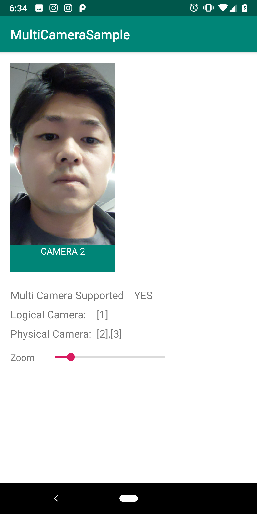
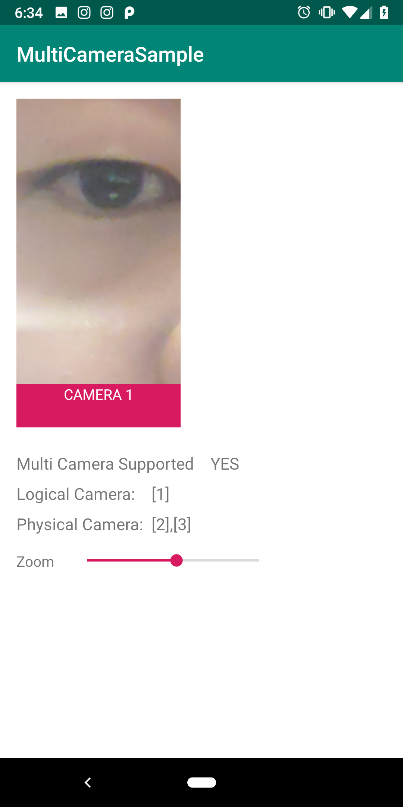

Sample App to demonstrate Camera2 multi-camera API

** Caution!!: This sample only runs upon Pixel3 **

## Requirements
- Android NDK (download from `Preferences` -> `Appearance & Behavior` -> `System Settings` -> `Android SDK` ) This is actually not required for this project but I have a plan to add OpenCV so cpp setting is currently in the project.

There are 2 modes available:

if you want to test, switch the value below
```
private val zoomTransition = true
```

1) 2 simultaneous camera steam view


2) Zoom with 2 cameras




